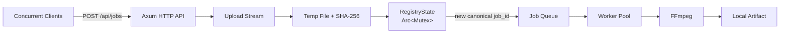
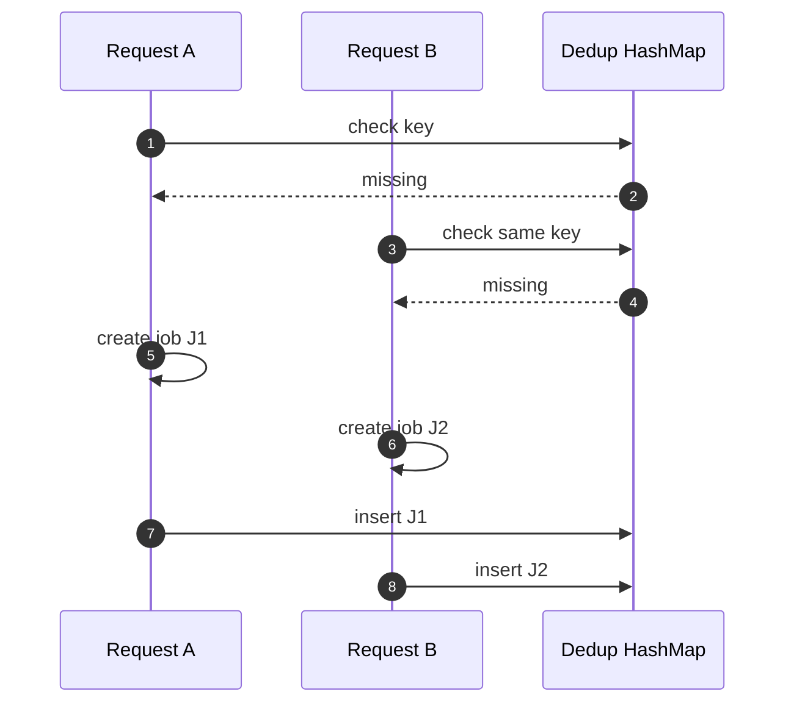
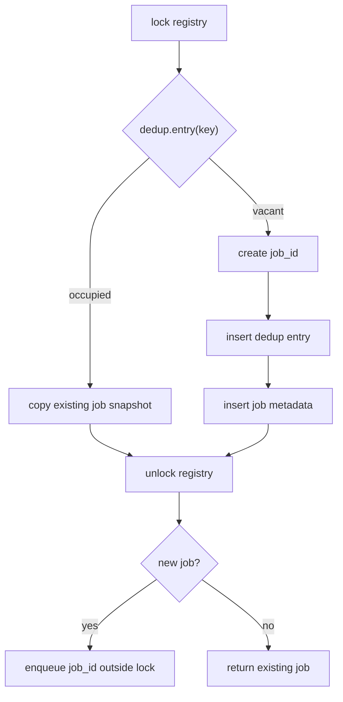
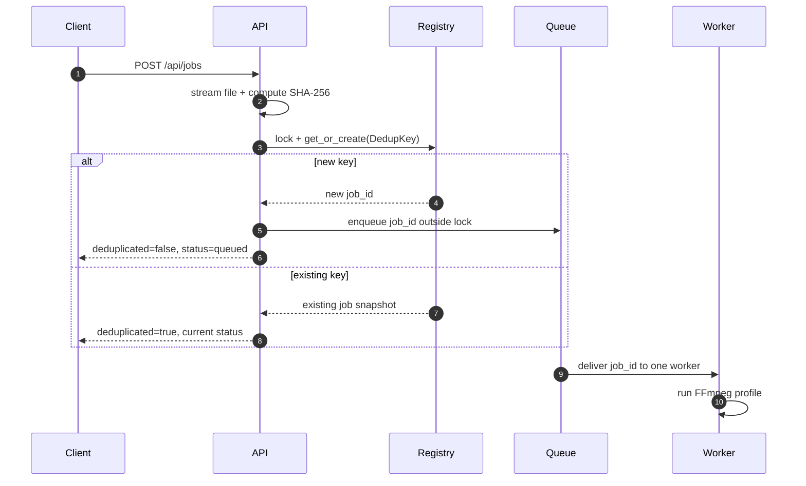
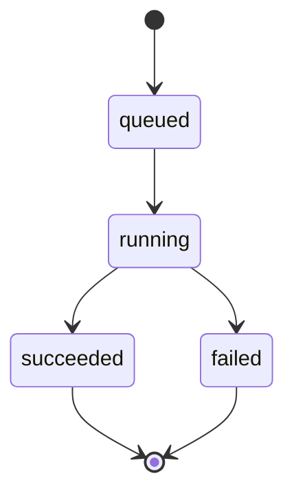

# Video Digest Server

Video Digest Server is a planned Rust/Tokio service for concurrent video uploads and FFmpeg transcoding.

When multiple clients upload the same video with the same profile, the target behavior is to create one canonical transcoding job and return that job ID to duplicate requests.

> Current status: design documentation only. Implementation will be added in later PRs.

## Scope

This project is intentionally scoped as a focused Video Digest Server implementation. The goal is not to build a full video platform, but to implement the backend path needed to demonstrate concurrent access to a shared resource, explain the race condition, fix it, and prove the fix with tests.

## Core Idea

The shared resource is the in-memory job registry:

```text
RegistryState {
  dedup: HashMap<DedupKey, DedupEntry>,
  jobs: HashMap<JobId, Job>,
}
```

The deduplication key is:

```text
DedupKey = (content_sha256, profile_name)
```

The main concurrency issue is a logical check-then-insert race in `dedup`. This is an application-level race condition, not a Rust memory data race.

## System Overview



Runtime state is kept in memory and is lost on restart. Uploaded files and output artifacts are stored on the local filesystem.

## Concurrency Goals

| Goal | Project behavior |
|---|---|
| Concurrent requests to the same resource | Multiple clients can upload the same bytes with the same profile at the same time |
| Race condition to analyze | Naive dedup lookup can create duplicate jobs for one `(content_sha256, profile_name)` |
| Fix | Protect `RegistryState` with `Arc<tokio::sync::Mutex<_>>` and keep lookup plus insert in one critical section |
| Evidence | Registry concurrency tests, upload integration tests, worker processing tests, and CI quality gates |

## Race Condition

Naive check-then-insert can create duplicate jobs:



The planned fix is to perform lookup and registry mutation inside one mutex-protected critical section:



The mutex protects registry mutation only. Upload streaming, hashing, FFmpeg execution, artifact download, queue enqueue, and response serialization happen outside the lock.

## Request Flow



If an upload is interrupted, the hash is not finalized and no job is registered.

## Failure Handling

| Failure | Effect |
|---|---|
| Upload connection dropped mid-stream | Hash is not finalized, no dedup entry, no job registered, temp file discarded |
| Client A drops mid-upload, then client B uploads the same bytes | A leaves no trace; B's upload computes its own hash and becomes the canonical job |
| FFmpeg exits non-zero | Job transitions `running -> failed`, `error` field stores a summary |
| Worker crash mid-FFmpeg | Job may remain `running`; automatic recovery is out of scope |
| Server restart | All in-memory job state is lost; uploaded inputs and finished artifacts on disk are not garbage-collected automatically |

## Job States



Invalid transitions are rejected.

## API Surface

| Method | Path | Purpose |
|---|---|---|
| `GET` | `/api/health` | Health check |
| `POST` | `/api/jobs` | Upload video and create or reuse a job |
| `GET` | `/api/jobs` | List recent jobs |
| `GET` | `/api/jobs/{job_id}` | Read job status |
| `GET` | `/api/jobs/{job_id}/artifact` | Download succeeded artifact |

Clients send only a profile name. Raw FFmpeg arguments from clients are not accepted.

## In Scope

- Rust/Tokio + Axum API
- multipart uploads
- SHA-256 content hashing
- in-memory dedup registry
- worker queue
- YAML FFmpeg profiles
- local filesystem artifacts
- focused concurrency and state-machine tests

## Out of Scope

- database persistence, including SQLite and PostgreSQL
- authentication and session management
- web dashboard or required UI
- distributed workers
- resumable uploads
- cloud object storage
- GPU acceleration or advanced codec tuning
- runtime profile reload
- production-grade observability and deployment automation

## Quality Gates

Once the Rust scaffold exists, CI should run:

```bash
cargo fmt --check
cargo clippy --all-targets -- -D warnings
cargo test --all
```

Implementation code should not use `unwrap()` or `expect()` outside tests.

## Benchmark Results

Benchmark numbers are not target KPIs and should not be filled in before implementation. After implementation, measured results can be recorded with this template:

| Scenario | Clients | Profile | Canonical jobs | Dedup hits | FFmpeg spawns | Duplicate jobs | Elapsed |
|---|---:|---|---:|---:|---:|---:|---:|
| same file concurrent upload | TBD | TBD | TBD | TBD | TBD | TBD | TBD |

## Documentation

- [Architecture](docs/ARCHITECTURE.md)
- [API specification](docs/API_SPEC.md)
- [Test plan](docs/TEST_PLAN.md)
