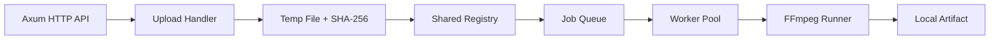
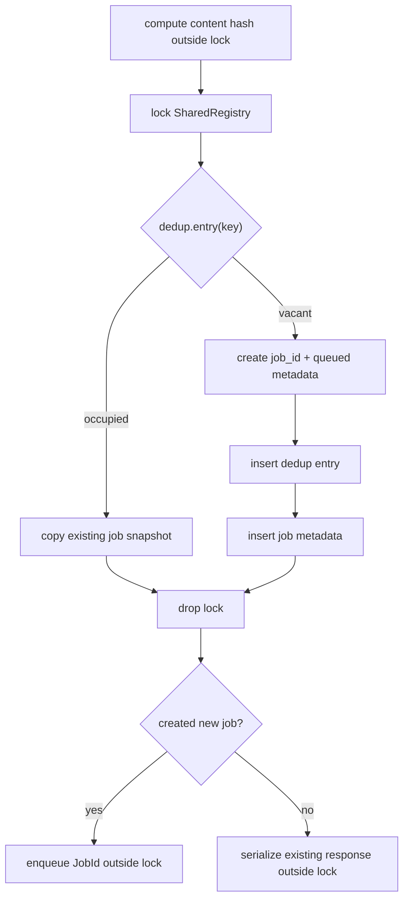
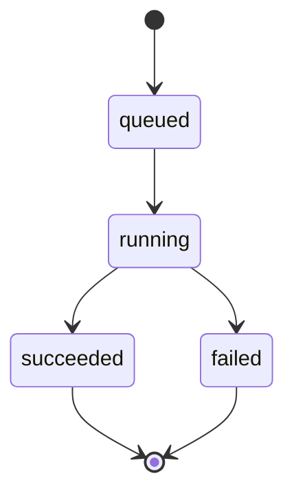

# Architecture

This document describes the current architecture.

## Overview



The system does not use a database. Runtime job state is stored in memory, while input files and artifacts are stored on the local filesystem.

## Components

| Component | Responsibility |
|---|---|
| HTTP API | Accept uploads, validate profile names, expose job status, expose artifact downloads |
| Upload Handler | Stream multipart body, write temp file, compute SHA-256, finalize hash after complete upload |
| Dedup Registry | Ensure one canonical job per `(content_sha256, profile_name)` |
| Job Queue | Deliver each queued `JobId` to at most one worker |
| Worker Pool | Move jobs through `queued -> running -> succeeded/failed` |
| Transcoder | Worker-facing port. Production adapter is `FfmpegRunner` (builds commands from server-side YAML profiles only). Tests substitute a mock implementation of the same trait |
| Local Storage | Store temporary uploads, canonical inputs, and output artifacts |

Workers depend on the `Transcoder` trait, not the concrete `FfmpegRunner`.
Production wires `Arc::new(FfmpegRunner::new(profiles))` into
`Arc<dyn Transcoder>`; worker-pool tests substitute `MockTranscoder` so CI
does not require an `ffmpeg` binary (`docs/TEST_PLAN.md` Mock Transcoder
section).

## Shared Registry

Target shared state:

```rust
type SharedRegistry = Arc<tokio::sync::Mutex<RegistryState>>;

struct RegistryState {
    dedup: HashMap<DedupKey, DedupEntry>,
    jobs: HashMap<JobId, Job>,
}

struct DedupKey {
    content_sha256: String,
    profile_name: String,
}

struct DedupEntry {
    job_id: JobId,
}

struct Job {
    job_id: JobId,
    status: JobStatus,
    profile_name: String,
    content_sha256: String,
    input_path: PathBuf,
    artifact_path: Option<PathBuf>,
    error: Option<String>,
}
```

These are target shapes, not final Rust definitions. The important boundary is that `dedup` and `jobs` are mutated through the same `RegistryState` lock.

## Mutex Choice

`tokio::sync::Mutex` is preferred over `std::sync::Mutex` so that a contended `lock().await` does not block the executor thread while waiting for the lock. The "no `.await` while holding the registry lock" rule still applies — that rule is about avoiding deadlocks and long-tail latency under the lock, not about whether the lock itself is async-aware. With async-aware locking and a strict no-await-under-lock policy, contention only delays other tasks rather than blocking executor threads.

## Registry Critical Section

The dedup operation must keep lookup and insertion in one critical section:



Rules:

- do not hold the registry lock while awaiting
- do not hold the registry lock while reading upload streams
- do not hold the registry lock while writing large files
- do not hold the registry lock while running FFmpeg
- do not hold the registry lock while downloading artifacts
- enqueue new jobs after the registry lock is dropped
- copy job snapshots under the lock, then serialize `GET /api/jobs` responses after the lock is dropped

## Job Queue Contract

The queue receives only canonical jobs. Deduplicated requests must not enqueue work.

The queue abstraction must guarantee:

```text
one JobId is delivered to at most one worker
```

A Tokio channel or an equivalent queue can satisfy this contract. Multiple workers may exist, but a single queued job must not be processed by more than one worker.

## Profile Handling

Profiles are loaded from server-side YAML configuration at startup. The client sends only the profile name.

The server must not accept raw FFmpeg arguments from clients.

The profile name is part of the dedup key:

```text
(content_sha256, profile_name)
```

Runtime profile reload is out of scope.

## Job State Machine



Allowed transitions:

- `queued -> running`
- `running -> succeeded`
- `running -> failed`

All other transitions should be rejected.

## Failure Modes

| Failure | Effect | Handling |
|---|---|---|
| Upload connection dropped mid-stream | No content hash, no dedup entry, no job metadata | Temp file is discarded |
| Same content uploaded by another client after a previous interrupted attempt | The previous attempt left no registry entry | The new upload becomes the canonical job |
| FFmpeg exits non-zero | Job transitions `running -> failed` | `Job.error` stores a stderr summary |
| Worker crash mid-FFmpeg | Job may remain `running` | Automatic recovery is out of scope |
| Server restart | All in-memory `RegistryState` is lost | On-disk inputs and artifacts survive but are not auto-reconciled with the new registry |

These are the design contracts; the implementation must keep them in sync with the test plan.
